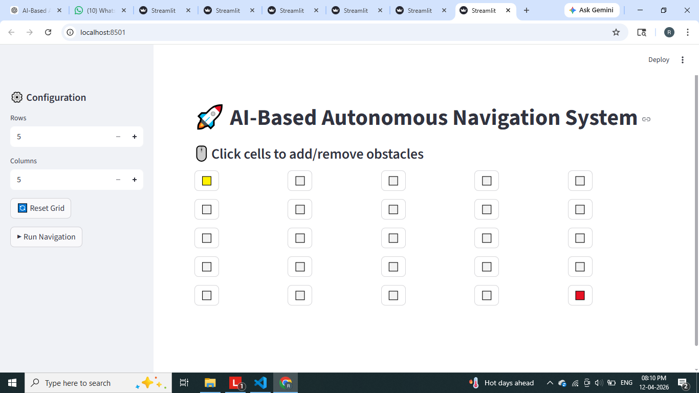
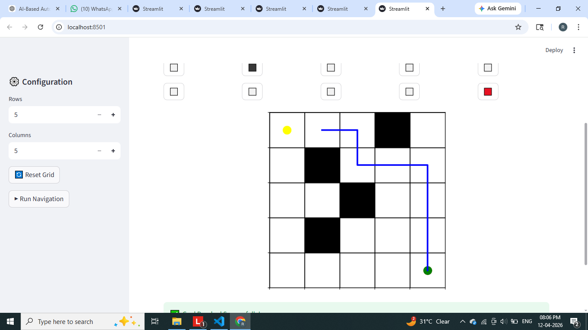

# 🚀 AI-Based Autonomous Navigation System

An interactive AI simulation that demonstrates **autonomous navigation using the A* path planning algorithm** with a modern **Streamlit web interface**.

---

## 📌 Project Overview

This project simulates how autonomous systems navigate in an environment while avoiding obstacles using AI.

---

## 🎯 Problem Statement

Autonomous systems must:
- Find shortest path  
- Avoid obstacles  
- Adapt dynamically  

This project solves this using A* pathfinding.

---

## 🌍 Real-World Applications

- Self-driving cars  
- Warehouse robots  
- Drone navigation  
- Delivery robots  

---

## ⚙️ Tech Stack

- Python  
- NumPy  
- Matplotlib  
- Streamlit  
- A* Algorithm  

---

## 🏗️ System Architecture


User Input (Grid)
↓
Obstacle Placement
↓
A* Algorithm
↓
Path Generation
↓
Visualization + Animation


---

## 📁 Project Structure (IMPORTANT)


AI-Autonomous-Navigation-System/
│
├── algorithms/
│ └── astar.py # A* algorithm implementation
│
├── src/
│ ├── app.py # Streamlit web app (MAIN FILE)
│ └── main.py # Optional pygame simulation
│
├── outputs/
│ └── screenshots/ # 📸 ALL IMAGES STORED HERE
│ ├── grid.png
│ ├── obstacles.png
│ └── navigation.png
│
├── requirements.txt
└── README.md


---

## 📸 Outputs

All output images are stored in:

outputs/screenshots/

---

### 🟢 Grid Interface

This shows the initial grid before adding obstacles.



---

### ⬛ Obstacles Added

Users can place obstacles dynamically on the grid.


---

### 🔵 Navigation Output

AI finds the optimal path and the agent moves from start to goal.

---

## 🚀 Installation

```bash
git clone https://github.com/your-username/AI-Autonomous-Navigation-System.git
cd AI-Autonomous-Navigation-System
python -m venv venv
venv\Scripts\activate
pip install -r requirements.txt
▶️ Run the Project
streamlit run src/app.py

🎮 How It Works
Set grid size
Click cells to add obstacles
Run navigation
AI finds path
Agent moves
📊 Outputs

✔ Grid generation
✔ Obstacle placement
✔ Path planning
✔ Real-time animation

📸 Screenshots
🟢 Grid Interface

⬛ Obstacles Added

🔵 Navigation Output

📈 Future Improvements
Add BFS / Dijkstra
Add speed control
Multi-agent system
Real-world integration
🧠 Learning Outcomes
A* Algorithm
AI navigation
Simulation systems
Streamlit UI
